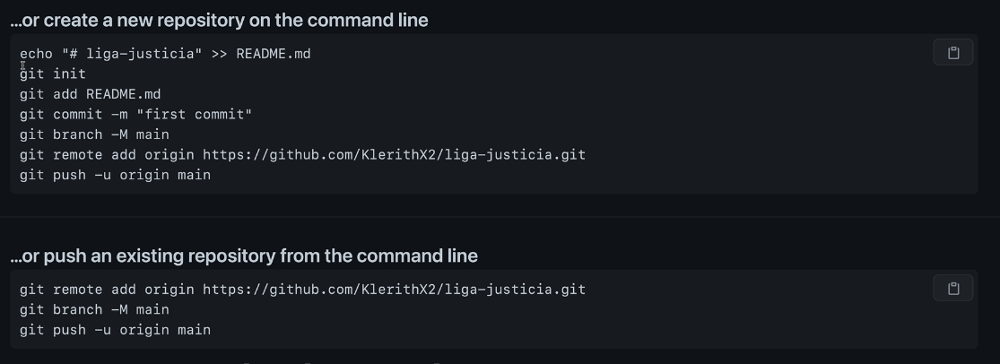

## NOTAS

- Los proyectos son conocidos como repositorios.

- Se aconseja que en windows se trabaje con git bash y en linux con la terminal.
  - Primer comnando:
-  
```git

# Inicializa el repositorio

$ git init 

# Realiza el cambio default de master a main

$ git config --global init.defaultBranch main

# Todos estos archivos no se les da seguimiento.

$ git status
On branch master

No commits yet

Untracked files:
  (use "git add <file>..." to include in what will be committed)
        01-bases.zip
        01-bases/
        Notas.md
        README.md
        __MACOSX/
        img/
        progit (2).pdf

nothing added to commit but untracked files present (use "git add" to track)

# El archivo index esta listo para hacerle un commit, mientras que los demas no.

$ git status
On branch master

No commits yet

Changes to be committed:
  (use "git rm --cached <file>..." to unstage)
        new file:   index.html

Untracked files:
  (use "git add <file>..." to include in what will be committed)
        .DS_Store
        css/
        fonts/
        images/
        js/
        main.html
        scss/

# Este comando carga todos los archivos a git.

$ git add .

# Este comando remueve un archivo del repositorio

$ git reset .DS_Store

# En este comando se le toma la fotografia al repositorio, la letra -m es message,
por estandar el nombre del primer commit es primer commit

$ git commit -m "Primer commit"

Algunos en la próxima clase han presentado este problema con el CRLF, no es nada serio, es básicamente una interpretación de un carácter.

Simplemente ejecuten este comando si presentan el error:

$ git config core.autocrlf true


# Se modifico, perdio o removio parte del codigo y este no fue contemplado, para revertir los cambios al ultimo commit que se realizo.

$ git checkout -- .

# Nos indica en que rama de git estamos trabajando

$ git branch

# Una rama es el lugar en que estamos trabajando

# Renombrar rama

$ git branch -m master main


#Datos globales

$ git config --global -e

# para salir de este modo se usa shift+:+q+!
# para escribir en este mod shift+:w:q+!

# si dimos un git add ., pero queremos revertir los datos, damos un:

$ git reset file

# si quiero hacer el commit y agregar la captura en la misma sentencia, solo funciona se le damos seguimiento al archivo

$ git commit -am "Readme actualizado"

# indica los commits que se realizaron
# el mian es la rama principal
# los commits se ordena del mas actual al mas antiguo, salir con :q

$ git log


# con comodines 
# debemos especificar el directorio

$ git add *.html

# .gitkeep -> indica que tiene que mantener esa carpeta

# Para agregar todo el contendio del folder debemos de escribir el nombre del folder

$ git add css

# Alias en GIT

$git config --global alias.s "status --short"

# Log
git config --global alias.lg "log --graph --abbrev-commit --decorate --format=format:'%C(bold blue)%h%C(reset) - %C(bold green)(%ar)%C(reset) %C(white)%s%C(reset) %C(dim white)- %an%C(reset)%C(bold yellow)%d%C(reset)' --all"

# Status
git config --global alias.s status --short

# Alternativa útil de status
git config --global alias.s status -sb

#Datos de vanderas

$ git log --oneline

$ git log --oneline --decorate --all --graph 

```

[Alias](https://gist.github.com/Klerith/0acf18bbece7923bcac55edb71b03c2b)

```git
# comando para ver los cambios comparados con staged

$ git diff --staged

# Modifica la descripcion del commit 

$ git commit --amend -m "Notas agregadas"

# El hard si elimina los cambios
$ git reset --hard 

# No elimina los cambios
$ git reset --soft HEAD^
$ git reset --soft ?hash?
#El HEAD apunta al ultimo commit, para apuntar al commit 
que se quiere es HEA^1,2,3,4 el numero de commit

# git add -A
Si aparece alguna alerta

# git config core.autocrlf true


# Es parecido al soft, pero este saca los cambios del stage

$ git reset --mixed ?hash?

# El hard es un comando destructivo ya que deja el repositorio
tal cual estaba en ese punto donde estamos

$ git reset --hard ?hash?

# El reflog refiere a todo lo realizado en el repositorio
$ git reflog

# Mover de una posicion a otra
$ git mv destruir-mundo.md salvar-mundo.md

#Remover un archivo

$ git rm salvar-mundo.md

# Crear siempre el .gitignore
para excluir carpetas 

# Una rama es otro punto en el tiempo

# Unir una rama a otra se le llama Merge

# Fast-forward
- se dispara cuando no hay nigun cambio en la rama principal
# Uniones Automaticas
- en la rama principal hubo un cambio, pero en las demas no
# Union manual
- se hace un merge comnit ya que git no puede y presenta conflicto

# Crear una rama
$ git branch "nombre rama"

# Ver ramas
$ git branch

# Cambiar de rama
$ git checkout "nombre de la rama"

# Hacer un merge es unificar los cambios de una rama con otra
$ git merge "nombre de la rama"

# Borrar Rama
$ git branch -d "nombre de la rama"

# Borrar de manera Forzada
$ git branch -d "nombre de la rama" -f

# Para crear y mover a la rama
$ git checkout -b "nombre de la rama"

# Tags - Etiquetas
# Un tag es un registro historico de que es mi primera version
# puede ser para cualquier version trabajar con versiones semnaticas

$ git tag "nombre de la etiqueta"

# Borrar un Tag
$ git tag -d "Nombre del Tag"

# crear una version anotada
$ git tag -a "Nombre del Tag" = v1.0.0 -m "Version 1.0.0 lista"

1 = es una version mayor
0 = se añade cierta funcionalidad, algo importante
0 = se encuentra un bug fix y hay que componerlo -> correccion de errores

# ver informacion del tag
$ git show v0.1.0 

# Stash
Es una bobeda en la cual se guardan los datos que no impactaran en el proyecto

$ git stash

# si quiero ver las referencias del stash
$ git stash list

# coloca nuevamente los datos
$ git stash pop

#Borrar todos los stash
$ git stash clear

#Retorno un stash de los que se crearon
$ $ git stash apply stash@{2}

#Retorna el stash y lo elimina del contenido
$ git stash drop stash@{2}

#mirar estado del stash
$ git stash show stash@{2}

#agregamos nombre al stash 
$ git stash save "villanos.md: agregamos a loky"

# Mostrar la lista
$ git stash list --stat

# Rebase
Permite unir commits, hace un squash, solo se hace si no afecta un repositorio 
externo.

# crea un espacio temporal y actuliza la rama
$ git rabse master

# Unificar ciertos commits el primero lo unio con alguno de los ultimos 4 commits
la union se realiza con s
$ git rebase -i HEAD~4

el renombre se realiza con r
$ git rebase -i HEAD~4

la edicion se realiza con e
$ git rebase -i HEAD~3

$ git reset HEAD^

$ git add file
$ git commit -m
$ git rebase --continue

# git es el sistema de versionamiento local en nuestro equipo 
# github es una plataform de desarrollo colaborativa de software para alojar
# proyectos.

# Push -> tomar los cambios del repositorio y subirlos al servidor, para que no esten de 
# de forma local.

# Pull -> tomar los cambios del servidor y cargarlos al repositorio de manera local.

Git no maneja el acceso al repositorio.
```

[Gitosis](https://wiki.archlinux.org/title/gitosis#:~:text=Gitosis%20is%20a%20tool%20which,system%20accounts%20on%20the%20server.)

[Instalacion](https://github.com/res0nat0r/gitosis)

Si es la primera vez del proyecto donde no se tiene existencia, ni trabajo previo del proyecto se utiliza el primer apartado.

Si ya existe el proyecto previamente con git y tiene un historial previo se utiliza la segunda opcion.




```git
echo "# git_curso" >> README.md
git init
git add README.md
git commit -m "first commit"
git branch -M main
git remote add origin https://github.com/Santiago78op/git_curso.git
git push -u origin main
```

```git
git remote add origin https://github.com/Santiago78op/git_curso.git
git branch -M main
git push -u origin main
```

#Para cargar los Tags que no se cargaron por defecto

```git
$ git push --tags
```

El releases es un punto donde se puede crear una parte del proyecto para descargar.

con el comando git pull -> actulizamos al rama si alguien mas realizo algun cambio

```git
$ git pull
```

para saver cual es el path donde se encuentra el repositorio se indica el comando:

```git
$ git remote -v
```

en el fetch es de donde se obtine la informacion y el pull es donde se sube la informacion.

Para que al hacer el pull siempre sea con las fast-forwwar

```git
$ git config --global pull.ff only
```

## FORK
Otra forma de colaboración, más desacoplada, es mediante las peticiones de fusión
(merge requests). Esta característica permite a cualquier usuario con acceso de lectura,
participar de manera controlada. Los usuarios con acceso directo pueden, simplemente,
crear la rama, enviar commits y luego abrir una petición de fusión desde su rama
hacia la rama master u otra cualquiera. Los usuarios sin permiso de push pueden hacer
un “fork” (es decir, su propia copia del repositorio), enviar sus cambios a esa copia, y
abrir una petición de fusión desde su fork hacia el proyecto del que partió. Este
modelo permite al propietario tener un control total de lo que entra en el repositorio,
permitiendo a su vez la cooperación de usuarios a los que no se confía el acceso total.
Las peticiones de fusión y las incidencias (issues) son las principales fuentes de
discusión en los proyectos de GitLab. Cada petición de fusión permite una discusión
sobre el cambio propuesto (similar a una revisión de código), así como un hilo de
discusión general. Ambas pueden asignarse a usuarios, o ser organizadas en hitos
(milestones).

***Presionas el boton FORK en github***

Para actualizar el repositorio del Fork se necesita los comandos


```git
$ git remote add upstream <repo original>
```

```git
$ git fetch upstream
```

## Issues

Son usados para realizar comentarios.

La siguiente pregunta puede ser “¿cómo hago una referencia a un Pull Request
antiguo?”. La respuesta es, de varias formas.
Comencemos con cómo referenciar otro Pull Request o una incidencia (Issue). Todas las
incidencias y Pull Requests tienen un número único que los identifica. Este número no
se repite dentro de un mismo proyecto. Por ejemplo, dentro de un proyecto solo
podemos tener un Pull Request con el número 3, y una incidencia con el número 3. Si
quieres hacer referencia al mismo, basta con poner el símbolo # delante del número, en
cualquier comentario o descripción del Pull Request o incidencia. También se puede
poner referencia tipo usuario#numero para referirnos a un Pull Request o incidencia en
una bifurcación que haya creado ese usuario, o incluso puede usarse la forma
usuario/repo#num para referirse a una incidencia o Pull Request en otro repositorio
diferente.
Veamos un ejemplo. Supongamos que hemos reorganizado la rama del ejemplo anterior,
creado un nuevo Pull Request para ella y ahora queremos hacer una referencia al viejo
Pull Request desde el nuevo. También queremos hacer referencia a una incidencia en la
bifurcación del repositorio, y una incidencia de un proyecto totalmente distinto. Podemos
rellenar la descripción justo como vemos en Referencias cruzadas en un Pull Request..